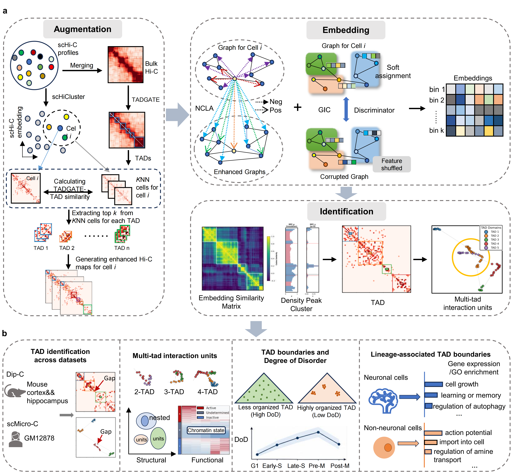

# CellTAD: Identifying single-cell TADs via graph contrastive learning #

----------

### Latest updates: September 20, 2026, version 0.0.1
## Contents:
1. [Overview](#1-overview)
2. [Installation](#2-installation)
3. [Usage](#3-usage)
4. [Update Log](#4-update-log)
5. [Maintainers](#5-maintainers)
6. [Citation](#6-citation)

## 1. Overview


CellTAD identifies topologically associating domains (TADs) in individual cells from sparse single-cell Hi-C / Micro-C contact maps. It consists of three modules:

- **Module 1, augmentation (`augmentation/`).** Single-cell maps are aggregated into a pseudo-bulk map, TADs are called on it with TADGATE, and cells are embedded with scHiCluster. For every TAD, the most similar cells among the k nearest neighbors are candidates; each augmented map of the anchor cell is built by adding Gaussian noise and replacing every TAD block with the block of a randomly drawn candidate.
- **Module 2, embedding learning (`model/`, `train/`).** A graph convolutional encoder is trained on the anchor cell and its augmented views with an NCLA contrastive loss and a GIC (Graph Information Clustering) regularization term, giving per-bin embeddings.
- **Module 3, TAD identification (`identification/`, `visualization/`).** TAD boundaries are identified directly from the embedding with a density-peak-style decision graph (rho insulation score, gamma = rho * delta) and visualized.

## 2. Installation
Please follow the steps below:
1. Install Python >= 3.9 (must match your torch/dgl version).
2. Clone this repository and cd into it as below.
```
git clone https://github.com/xyWangM/CellTAD.git
cd CellTAD
```
3. Create a new conda environment and install the packages in `requirements.txt` (check the torch/dgl versions against your CUDA version).
```
conda create -n CellTAD python=3.9
conda activate CellTAD
pip install -r requirements.txt
```
4. Clone the two external dependencies into `external/` (they are imported as libraries, not pip-installed).
```
git clone https://github.com/zhanglabtools/TADGATE.git external/TADGATE
git clone https://github.com/zhoujt1994/scHiCluster.git external/scHiCluster
```
5. TADGATE clusters with Mclust by default, which needs R, the R package `mclust` and `rpy2`.
```
R -e 'install.packages("mclust", repos="https://cloud.r-project.org")'
pip install "rpy2>=3.5"
```
Without R, set `CLUSTER_METHOD = 'K-means'` in `augmentation/run_TADGATE.py` (this changes the clustering used for the TAD calls).
6. For `.hic` input, also install `hic-straw`.
```
pip install hic-straw
```
> **Note:** install `rpy2` and `hic-straw` inside the conda environment. Copies in `~/.local` take precedence and cause hard-to-trace errors; check with `python -c "import rpy2, hicstraw; print(rpy2.__file__, hicstraw.__file__)"` or run with `PYTHONNOUSERSITE=1`.

## 3. Usage
### Download the dataset that will be analyzed.

- scMicro-C dataset (human GM12878, hg38): [Wu, 2025](https://doi.org/10.1038/s41588-025-02247-6)
  [https://www.ncbi.nlm.nih.gov/geo/query/acc.cgi?acc=GSE279583](https://www.ncbi.nlm.nih.gov/geo/query/acc.cgi?acc=GSE279583)
  (cells are named `GM-*U_*`; the demo anchor `GM-800U_006` comes from the 800U group)
- Dip-C dataset (mouse cortex/hippocampus, mm10, the same data as CellLoop): [Tan, 2021](https://www.cell.com/cell/fulltext/S0092-8674(20)31754-2)
  [https://www.ncbi.nlm.nih.gov/geo/query/acc.cgi?acc=GSE162511](https://www.ncbi.nlm.nih.gov/geo/query/acc.cgi?acc=GSE162511)

### Required input files

- **Contact pairs** (default): one tab-separated file per cell, `<base_dir>/GSE279583_extracted/<cell>.allValidPairs.txt`, with columns 2-5 = `chr1 pos1 chr2 pos2` (chromosome written `chr1` or `1`); lines starting with `#` are ignored.
- **`.hic`** (e.g. Dip-C, `GSM4382149_cortex-p001-cb_001.contacts.hic`): put all files in one directory and pass it with `--hic-dir` together with `--run-augmentation`. Step 0 converts them to pairs at `--resolution` (which must be stored in the `.hic`), renames the cells `cell_001, cell_002, ...` (`<base_dir>/cell_id_map.tsv`) and skips low-quality or failing cells (`hic_to_pairs_low_quality.tsv`).
- **Genome**: `--chrom-sizes data/chrom_hg38_sizes.txt` (default) or `data/chrom_mm10_sizes.txt`.

### CellTAD Parameter Guide
- Defaults live in `config.py::get_default_config()`; the common ones can be overridden on the command line.

#### 1). Required Parameters

| Parameter | Description | Example / Notes |
|---|---|---|
| `--base-dir` | Dataset root directory | `/mnt/d/model/data/2025_scMicroc` |
| `--anchor-cell` | Anchor cell name | `GM-800U_006`; with `.hic` input the original file name or `cell_XXX` |
| `--chrom` | Chromosome | `chr1` |
| `--resolution` | Resolution (bp) | `50000` |
| `--output-dir` | Embedding / training output directory | `/mnt/d/model/embedding/scMiroc/006/chr1` |
| `--hic-dir` | Directory with single-cell `*.hic` files | Omit for pairs input |
| `--chrom-sizes` | Chromosome size table (selects the genome) | Relative paths are looked up in the current directory, then in the project root |

> **Note:** use `--demo` to skip all of the above and run the bundled demo instead.

#### 2). Optional Parameters

| Parameter | Description | Notes |
|---|---|---|
| `--demo` | Run a demo bundled in `data/demo/`, chosen by `--anchor-cell` | Default `GM-800U_006` (scMicro-C); `GSM4382149_cortex-p001-cb_001` selects the Dip-C demo (mm10) |
| `--run-augmentation` | Run the augmentation pipeline (Steps 0-7) before training | |
| `--augmentation-anchor-only` | Steps 6-7 only for `--anchor-cell` | Needs `--run-augmentation`; about 0.6 GB instead of about 113 GB for 185 cells |
| `--augmentation-start-from` / `--augmentation-only` | Start from / run only one step (0 = `.hic` to pairs) | |
| `--augmentation-force` | Ignore existing outputs and caches | |
| `--run-identification` / `--run-visualization` | Identify and visualize TADs after training | Same implementation |
| `--visualization-outdir` | Figures and TAD tables | Default `<output-dir>/visualization/tad` |
| `--num-epochs`, `--device` | Training epochs (220), `auto` / `cpu` / `cuda` | |
| `--logfile` | Log file | Default `<output-dir>/CellTAD.log` |

> **Note:**
> - Model, graph and loss hyperparameters (`adj_max_dist`, `alpha_max`, `gic_tau`, `n_aug_views`, ...) and the regions to identify (`visualization_regions`, default 33-36, 66-69, 85-88, 90-93 Mb) are set in `config.py`; the TAD-detection and UMAP constants are at the top of `visualization/tad.py::main()`.
> - `--demo` cannot be combined with `--run-augmentation`, `--augmentation-only`, `--augmentation-start-from` or `--hic-dir`.

---

### Running CellTAD

#### Demo

```
conda activate CellTAD
python CellTAD.py --demo --run-identification --run-visualization
```

#### Example: scMicro-C (contact pairs, hg38)

```
python CellTAD.py --base-dir /path/to/2025_scMicroc --anchor-cell GM-800U_006 \
    --chrom chr1 --run-augmentation --run-identification --run-visualization
```
Omit `--run-augmentation` if the augmented maps already exist.

#### Example: Dip-C (`.hic`, mm10)

```
python CellTAD.py \
    --hic-dir /path/to/dipC/hic_files_cortex \
    --base-dir /path/to/dipC/celltad_run/cortex_p001 \
    --anchor-cell GSM4382149_cortex-p001-cb_001 \
    --chrom chr1 --resolution 50000 \
    --chrom-sizes data/chrom_mm10_sizes.txt \
    --output-dir /path/to/dipC/output/cortex_p001/chr1 \
    --run-augmentation --augmentation-anchor-only \
    --run-identification --run-visualization
```
The augmentation is long (Step 2 about 18 minutes on CPU, Step 3 processes every cell), so run it in `tmux` / `nohup`. Finished steps are skipped when the command is rerun. `CellTAD.log` holds only the messages of `CellTAD.py` itself; append `2>&1 | tee run_console.log` to keep the output of every step.

CellTAD runs the following steps:

**Step A (optional).** Augmentation pipeline (`--run-augmentation`):

| Step | Script | Main output (under `<base_dir>`) |
|---|---|---|
| 0 (`.hic` only) | `convert_hic_to_pairs.py` | `GSE279583_extracted/cell_XXX.allValidPairs.txt`, `cell_id_map.tsv` |
| 1 | `generate_pseudobulk.py` | `tadgate_results/bulk_hic/chr1_bulk_50000bp.npy` |
| 2 | `run_TADGATE.py` | `tadgate_results/tad_boundaries/chr1_TADs.csv` (embedding cached) |
| 3 | `generate_cell_embedding.py` | `embedding/800U/decomp/total_decomp.npz` |
| 4 | `find_neighbor_cells.py` | `similar/similar_cells.pkl` (k = 10) |
| 5 | `select_TAD_neighbors.py` | `similar/tad_top10_similar_cells.json` |
| 6 | `generate_augmented_contacts.py` | `enhanced_maps/cell_XXX/chr1/enhanced_topN.npy`, `stats.json` |
| 7 | `convert_to_cool.py` | `enhanced_maps/cell_XXX/chr1/enhanced_topN.cool` |

**Step B.** Train the embedding (`train/train_CellTAD.py`). The views are the anchor plus the ten augmented `.cool` maps (`n_aug_views = 0`); NCLA only during `warmup_epochs`, then GIC is added. The per-bin embedding of all views is concatenated into `<anchor>_<chrom>_embedding.npy`.

**Step C+D (optional).** Identify TADs region by region from the embedding, plot the Hi-C map, the similarity matrix and the UMAP, and write the TAD tables (`visualization/tad.py`).

> **Notes on the augmentation pipeline:**
> - A step counts as done when its output exists. The markers of Steps 3-7 do not contain the chromosome or resolution, so use **a separate `--base-dir` per chromosome / resolution** (or `--augmentation-force`).
> - Step 2 runs on the pseudo-bulk map of all cells; these are the reference TADs used in Step 6, not the final single-cell TADs. Step 3 has no per-cell resume.
> - The `.npy` files of Step 6 are intermediates and can be deleted once the `.cool` files exist.
> - If the anchor was removed in Step 0, CellTAD stops with a clear error; see `hic_to_pairs_low_quality.tsv` and choose another anchor.
> - The Hi-C panel and the `hic_ratio` column need a pairs file; for a `.hic` / `.cool` anchor they are left empty with a warning.
> - Each step script can be run alone, with settings passed as `CELLTAD_*` environment variables (`CELLTAD_BASE_DIR`, `CELLTAD_CHROM`, `CELLTAD_RESOLUTION`, `CELLTAD_HIC_DIR`, `CELLTAD_ANCHOR_CELL`, `CELLTAD_FORCE`, ...).

### Outputs

Augmentation (`<base_dir>/`): `GSE279583_extracted/`, `cell_id_map.tsv`, `tadgate_results/`, `schicluster_cool/`, `embedding/800U/`, `similar/`, `enhanced_maps/cell_XXX/chr1/`.

Training (`<output-dir>/`, `<pre>` = `<anchor_cell>_<chrom>`): `<pre>_embedding.npy`, `<pre>_embedding_znorm.npy`, `<pre>_insulation_scores.npy`, `<pre>_view<i>_embedding.npy`, `<pre>_losses_v62.json`, `<pre>_model_v62.pth`.

Identification and visualization (`<output-dir>/visualization/tad/`, `<ts>` = start time of the run):
```
tad_viz_<start>-<end>Mb_<ts>.png                 UMAP + Hi-C figure, one per region
tad_table_<chrom>_<start>-<end>Mb_<ts>.csv       TAD table, one per region
tad_table_<chrom>_all_regions_<ts>.csv           all regions combined
external_metrics_<chrom>_<ts>.csv                external metrics, one row per region
```
- **TAD table**: `region`, `chromosome`, `tad_id`, `start_bp`, `end_bp`, `start_bin`, `end_bin`, `size_bins`, `hic_ratio` (Hi-C insulation check at the left boundary, lower = sharper).
- **External metrics**: `n_tads`, `hic_ratio_mean`, `adj_sim_mean`, `n_noise`, `boundary_like_neighbor_pct`, `boundary_margin_mean`. They do not depend on the UMAP. A `boundary_like_neighbor_pct` clearly above 50 % with a clearly positive margin suggests a systematic boundary shift.

---

## 4. Update Log

- v0.0.3:
    - New: `.hic` input (Step 0, `--hic-dir`), genome selection (`--chrom-sizes`, hg38 / mm10), anchor-only Steps 6-7 (`--augmentation-anchor-only`, float32 maps), TADGATE embedding cache and an Mclust wrapper for `mclust >= 6.1` under rpy2, `--visualization-outdir`, a Dip-C demo selected by `--anchor-cell`.
    - Fixes: `detect_tads_paper()` raised a `NameError`; `visualization/tad.py::main()` now takes the arguments `CellTAD.py` passes, writes the TAD tables and metrics to disk and skips regions outside the chromosome; `--device auto` is resolved inside training; Step 3 follows `--chrom`; the `enhanced_maps/cell_XXX` name is zero-padded; `logger.py` writes UTF-8.
    - Changes: `n_aug_views` now defaults to `0` (was `10`), so training uses the augmented maps of Step 7; the visualization output follows `--output-dir`; conflicting or invalid options stop with a clear error.
    - Code cleanup: comments and docstrings in English; no change to any formula, model architecture or loss.
- v0.0.2: `logger.py` robustness fixes; README rewritten in CellLoop style.
- v0.0.1: first reorganization into a CellLoop-style package layout (`augmentation/ model/ train/ identification/ visualization/`); no change to any formula, model or loss.

---

## 5. Maintainers
(TBD)

---

## 6. Citation
(TBD)

CellTAD builds on [TADGATE](https://github.com/zhanglabtools/TADGATE) and [scHiCluster](https://github.com/zhoujt1994/scHiCluster); if you use CellTAD, please also cite:

- Dang, D., Zhang, S.W., Dong, K., Duan, R. & Zhang, S. "Uncovering topologically associating domains from three-dimensional genome maps with TADGATE." *Nucleic Acids Research* 53(4), gkae1267 (2025).
- Zhou, J., Ma, J., Chen, Y., et al. "Robust single-cell Hi-C clustering by convolution- and random-walk-based imputation." *PNAS* 116(28), 14011-14018 (2019).

---
